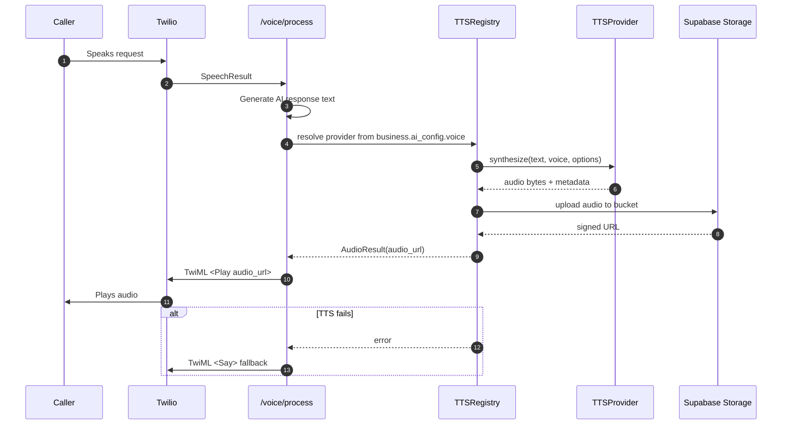

# TTS Architecture (Vendor-Agnostic, Supabase Storage)

## Goals
- Vendor-agnostic TTS: swap Deepgram/ElevenLabs/Wispr without core changes.
- Clean separation of concerns: voice flow never calls vendor SDKs directly.
- Twilio-friendly output: return a stable audio URL for `<Play>`.
- Caching and reuse: avoid regenerating identical audio.
- Safe fallbacks: degrade to `<Say>` if TTS fails.

## Components
- `TTSProvider` interface
  - `synthesize(text, voice, options) -> AudioResult`
  - `supports_streaming -> bool`
- `TTSRegistry`
  - Resolves provider by `business.ai_config.voice.provider`
- Provider adapters
  - `DeepgramProvider`, `ElevenLabsProvider`, `WisprProvider` (each implements `TTSProvider`)
- `AudioStorage`
  - Supabase Storage bucket handler (upload, signed URL)
- `AudioCache`
  - Deterministic key `(provider, voice_id, options, normalized_text)` -> storage path

## Configuration (per business)
Stored in `business.ai_config.voice`:
```json
{
  "voice": {
    "provider": "deepgram",
    "voice_id": "aura-asteria-en-au",
    "speed": 1.0,
    "pitch": 0,
    "style": "warm",
    "language": "en-AU"
  }
}
```

## Storage Strategy (Supabase)
- Bucket: `tts-audio`
- Path pattern:
  - `tts/{business_id}/{provider}/{hash}.mp3`
- Access:
  - Use signed URLs with a short TTL (e.g., 10-30 minutes)
  - If we need persistent public URLs, store public bucket and rotate keys carefully

## Audio Cache Key
```
hash = sha256(
  provider + "|" + voice_id + "|" + language + "|" + speed + "|" + pitch + "|" + style + "|" +
  normalize(text)
)
```
Normalization should trim, collapse whitespace, and standardize punctuation.

## Failure Behavior
- TTS provider failure -> fallback to Twilio `<Say>`
- Storage upload failure -> fallback to `<Say>`
- Missing provider config -> fallback to default Twilio `<Say>`
- All failures are logged with provider latency and error details.

## Sequence Diagram


## 2-Second Answer KPI: Fast Path vs Slow Path
### Fast Path (initial response <2s)
- **Pre-generate greetings** per business and store in Supabase Storage.
- Webhook returns TwiML that immediately `<Play>`s the cached greeting URL.
- No AI or TTS calls on the critical path; those start **after** response.

### Slow Path (subsequent turns)
- Start TTS generation asynchronously while returning a short fallback response.
- Prefer cached audio for common phrases; otherwise:
  - If TTS ready in ~1s: `<Play>` audio URL
  - Else: `<Say>` fallback and keep the conversation moving

### Practical Timings
- Twilio webhook processing budget: **<200ms**
- Network calls on critical path: **0**
- TTS generation budget (background): **~1-2s**
- Storage upload + signed URL: **<200ms**

### Implementation Notes
- Maintain a **greeting cache** table and pre-generate on business creation/update.
- Use a **background task queue** for TTS jobs.
- Add a **timeout guard**: if TTS isn't ready quickly, fallback to `<Say>`.
- Co-locate backend to AU region for low latency.

### Operational Checklist (Latency & Reliability)
- Track end-to-end webhook latency (p50/p95/p99).
- Log TTS provider latency and error rate per tenant.
- Alert if greeting cache miss rate exceeds 5%.
- Cap TTS generation time (e.g., 1200ms); fallback on timeout.
- Monitor Supabase Storage upload time and signed URL generation time.

### Metrics Schema (Example)
Capture these fields per TTS attempt:
```json
{
  "event": "tts.synthesize",
  "business_id": "uuid",
  "provider": "deepgram",
  "voice_id": "aura-asteria-en-au",
  "text_hash": "sha256",
  "cached": false,
  "latency_ms": 842,
  "storage_upload_ms": 96,
  "signed_url_ms": 18,
  "success": true,
  "error": null,
  "timestamp": "2026-01-18T10:15:30Z"
}
```

For webhook latency:
```json
{
  "event": "voice.webhook",
  "business_id": "uuid",
  "call_sid": "CA...",
  "latency_ms": 165,
  "response_type": "play|say",
  "timestamp": "2026-01-18T10:15:30Z"
}
```

### Dashboard & Alerts (Reference)
**Suggested charts**
- Webhook latency: p50/p95/p99 (last 1h, 24h)
- TTS provider latency and error rate by provider
- Greeting cache hit rate
- TTS fallback rate (`response_type = say`)

**Alert thresholds**
- Webhook p95 > 800ms for 5 minutes
- TTS error rate > 3% for 10 minutes
- Greeting cache miss rate > 5% in 1 hour
- Storage upload p95 > 400ms for 10 minutes

### Implementation Checklist
- Create TTS provider interface + registry
- Add Supabase storage uploader with signed URL support
- Pre-generate greeting audio per business
- Add cache key hashing + reuse
- Integrate with Twilio `<Play>` and fallback to `<Say>`
- Add metrics + logs for latency and errors

## Deployment Notes
- Create Supabase bucket `tts-audio`
- Set `SUPABASE_URL` and `SUPABASE_SERVICE_KEY` in backend env
- Set `DEEPGRAM_API_KEY` in backend env

## Admin Endpoint (Greeting Cache)
Generate and store a cached greeting audio URL:
```
POST /admin/tts/greeting/{business_id}
```

Expected response:
```json
{ "status": "ok", "audio_url": "https://..." }
```

## Integration Points in Code
- `app/integrations/tts/providers/*`
- `app/integrations/tts/registry.py`
- `app/integrations/tts/storage.py`
- `app/api/v1/voice.py` uses registry and returns `<Play>` or `<Say>`

## Operational Considerations
- Rate limit per tenant to control cost.
- Record provider latency and error rate metrics.
- Optional: webhooks for provider usage tracking.

## Security Considerations
- Never store vendor API keys in client code.
- Use Supabase service role for uploads.
- Signed URLs with TTL for playback.
